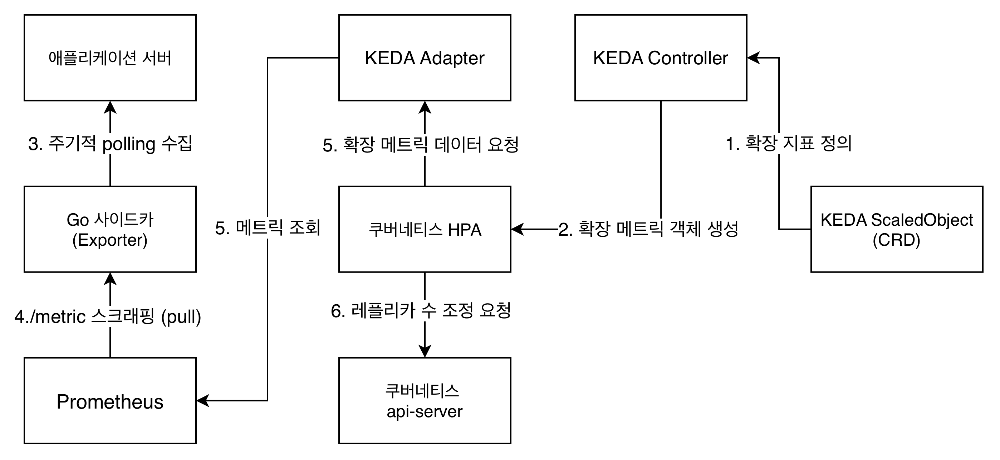

# HexWar Exporter

**HexWar 게임 서버용 Prometheus 메트릭 Exporter — Go 기반 관측가능성 사이드카**

C#/.NET 기반의 실시간 분산 게임 서버(HaxWar)의 상태를 주기적으로 폴링하여 Prometheus 표준 포맷으로 변환합니다. 단순 메트릭 수집을 넘어, K8s 환경에서 HPA(수평 Pod 자동 확장)와 연동되는 관측 파이프라인의 핵심 역할을 수행합니다.


## 목차
- [프로젝트 개요](#프로젝트-개요)
- [기술 스택](#기술-스택)
- [💡 핵심 기술 결정 및 최적화](#-핵심-기술-결정-및-최적화)
  - [1. 관측 데이터 기반 k8s 동적 노드 확장](#1-관측 데이터 기반 k8s 동적 노드 확장)
  - [2. k8s 게임 서버 오토스케일링](#2-k8s-게임-서버-오토스케일링)
  - [3. 로그 수집 에이전트 구축](#3-로그-수집-에이전트-구축)
- [로컬 실행 방법](#로컬-실행-방법)

## 프로젝트 개요

.png)

## 기술 스택

| 분야 | 기술 | 사용 이유 |
| --- | --- | --- |
| **언어/런타임** | Go 1.22 | 메모리 저용량 점유 |
| **쿠버네티스** | k3d (로컬) | 경량 로컬 클러스터 구성 |
| **오토스케일링** | Agones 혹은 KEDA, HPA, Karpenter |  동적 노드 확장 |
| **관측 스택** | QuickWit, kafka, vector, Prometheus, Grafana, OTel Collector | 관측 프로세스 구축 |
| **인프라 검증** | LocalStack, kwok, minio  | 로컬 시나리오 자원 모방 |

## 💡 핵심 기술 결정 및 최적화

### 1. 관측 데이터 기반 k8s 동적 노드 확장

#### 문제
* **확장 불가능:** 기존 Docker Compose 기반 환경은 K8s와 달리 HPA와 같이 시스템 상태를 지속적으로 모니터링하고 컨테이너 개수를 능동적으로 조절하는 제어 루프 메커니즘이 없습니다. 트래픽 급증 시 사람의 개입이 필수적이라 프로덕션 환경에 부적합하였습니다.
* **생명주기 식별 불가:** 오토스케일링을 도입 하였으나, 스케일 다운 시 진행 중인 게임 세션이 포함된 Pod가 강제 종료되는 것을 방지하는 세션 생명주기 관리 방식이 필요하였습니다. 

#### 행동
* **생명 주기 부여 및 확장:** Pod 별로 Agones를 통해 생명주기의 변화를 Agones Contorller에 전송하고, Redis를 통해 세션의 수를 저장도록 구축하였습니다. 스케일 다운 발생 시 진행 중인 세션이 잔존하는 Pod는 종료 대상에서 제외되고, 세션이 완전히 종료되거나 없는 Pod만을 수거하도록 하여 게임 데이터가 유실되거나 서비스가 중단되는 문제를 방지하였습니다.
* **관측 데이터 기반 확장:**  생명주기가 없는 서비스에 대비, KEDA ScaledObject와 HPA를 연동하여 Prometheus 메트릭 기반에 따라 오토스케일링을 구현했습니다. KEDA는 Datadog · InfluxDB · Kafka 등 60개 이상의 외부 프로세서를 지원하는 구조이므로, 동시접속자 수나 매치 대기열 길이 등 서버 특성에 맞는 지표로 트리거를 교체하더라도 동일한 ScaledObject 구조를 재사용할 수 있도록 설계했습니다.
* **인프라 모킹 테스트:** k3d와 LocalStack을 연동하여 실제 AWS 인프라 호출하는 검증 환경을 로컬에 구축했습니다. 특히 karpenter 기반 오토스케링을 로컬에서 테스트하기 위해 가상 노드 시물레이터인 kwok를 활용하고, karpenter-game-nodepool을 정의하여, 클라우드 비용 없이도 노드 자동 확장 파이프라인을 모방 및 검증했습니다.



#### 결과 및 검증 데이터


1. **Karpenter 노드 확장 구현 검증**
   * **검증 내용:** Karpenter가 Pending Pod를 감지하고 워커 노드를 자동으로 프로비저닝하여 Pending 상태를 해소하는지 검증했습니다. 검증 데이터에서는 KEDA를 사용하였으나 Agones Controller를 설치하여 Pod를 증가시키는 것으로도 동일한 검증이 가능합니다.
   * **로그 데이터:**
     ```text
      {"message":"found provisionable pod(s)","pods":3}
      {"message":"computed new node(s) to fit pod(s)","nodes":1,"pods":3}
      {"message":"created node","nodepool":"karpenter-game-nodepool","node":"kwok-node-abcd"}
     ```
   * **결과:** NodePool에 정의를 확인하고 그에따른 컴퓨팅 자원을 확보하는 것을 확인하였습니다. 스크립트 내에서는 20개의 노드가 자동으로 생성되었습니다. 이는 `scripts/test_e2e_scaling.sh` 스크립트를 통해 검증되었습니다.

### 2. Loki + Quickwit 기반 로그 수집 파이프라인 구축

#### 문제
* **로그 데이터 부제:** 시스템의 전반적인 상태를 파악하기 위해서는 메트릭 뿐만 아니라 로그 데이터가 반드시 필요합니다. 그러나 쿠버네티스 환경에서는 각 Pod가 독립적으로 로그를 생성하기 때문에, 중앙에서 체계적으로 수집하고 관리하는 시스템이 없다면 장애 발생 시 원인 분석이 어렵다는 것을 알게되었습니다.

#### 해결
* **기술 선택 이유 :** Elasticsearch를 선택하지 않은 이유는 저장 비용과 컴퓨팅 리소스 사용률이 높아 장기간 데이터를 보관하기 불리하지만, Quickwit는 객체 저장소 사용, 검색 노드의 무상태성을 통해 해당 단점을 보안하기 유리하였습니다. 하지만 인덱스 처리 시간이 다소 느린 단점이 존재하여 Loki를 추가적으로 도입하도록 설계하였습니다.
* **Loki + Promtail 실시간 로그 수집:** Promtail을 통해 클러스터 내 Pod 로그를 수집해 Loki에 전달하도록 구성했습니다. Loki는 로그 본문을 분해하여 인덱싱하지 않고 라벨만 인덱싱하여 처리 과정의 비용이 낮고 시간 단위 청크 생성 방식으로 실시간 수집 및 조회에 유리하여 Quickwit의 배치 지연을 보완합니다.
* **QuickWit 장기 보관 및 분석 환경:** 인덱스 데이터를 객체 저장소에 Split 단위로 저장하고, 검색 시 메타스토어를 통해 관련 Split만 선택적으로 로드하는 방식으로 동작합니다. 검색 노드가 무상태로 운영되어 컴퓨팅 자원을 효율적으로 사용하면서도 Loki 대비 빠른 검색 성능을 제공하며, 파일 사스템이 아닌 객체 저장소를 기반으로 동작하여 장기 보관에도 비용이 효율적입니다. 객체 저장소는 minio를 이용하여 로컬 구현하였습니다.
* **데이터 파이프라인 구축:** Vector를 통해 수집된 로그를 Kafka에 적재하고, Quickwit에서 배치 작업으로 처리하게 하여 인덱싱 처리 비용을 절감했습니다.

#### 결과 및 검증 데이터

1. **Quickwit 로그 데이터 압축 성능 검증**
   * **검증 내용:** Quickwit의 객체 저장소 기반 인덱싱 및 약 700만건의 데이터의 로그 데이터를 vector를 통해 유발시킨 후 적제된 데이터 용량을 확인하였습니다.
   * **압축 성능 데이터:**
     | 구분 | 1,000건 데이터 | 전체 누적 데이터  |
     | :--- | :---: | :---: |
     | **원본 로그 용량 (Uncompressed)** | 약 274.4 KB | 약 2.8 GB |
     | **Quickwit 인덱스 용량 (Compressed)** | 약 56.5 KB | 577.0 MB |
     | **압축 비율 / 용량 절감률** | **4.85 : 1** (**-79.4%**) | **4.85 : 1** (**-79.4%**) |
   * **결과:** Quickwit을 통해 원본 대비 79.4% 용량을 절감했습니다. 이를 통해 700만 건 기준 약 2.2GB의 스토리지를 절약하고, 객체 저장소 기반의 장비 보관 환경이 비용적인 측면 효율적이라는 것을 확인하였습니다.

### 3. 메트릭 관측 파이프라인 구축

#### 문제
* **결합도 및 스크래핑 지연 :** 메인 서버 내부에 메트릭 수집을 위한 엔드포인트 노출 시 Prometheus 라이브러리와 변환 로직이 게임 도메인 코드에 포함되어, 모니터링 스펙에 의존하게 되면 도메인 경계성이 모호해진다고 판단하였습니다.

#### 행동
* **도메인 분리:** 게임 서버 코드에는 Prometheus 관련 라이브러리와 변환 로직을 포함하지 않고, 메트릭 수집·포맷팅·캐싱 책임을 사이드카 서버에 위임해 도메인 경계를 명확히 분리했습니다.
* **언어 특성 최적화:** C# .NET 게임 서버는 복잡한 세션 및 상태 동기화와 같이 게임 도메인에 집중하도록 하고, 메트릭 수집 및 텍스트 포맷팅/캐싱 작업은 Go 언어의 경량 단일 바이너리와 낮은 메모리 사용량을 바탕으로 동일한 Pod에서 배포되는 사이드카 서버를 구축하여 컴퓨팅 자원에 대한 간섭을 최소화하였습니다. 
* **서킷 브레이커 구축:** 수집 대상의 장애로 Expoter가 수집을 진행하기 워해 동기적으로 호출하게되는데 이때 타임아웃이 발생하기 이전까지 무한한 대기에 빠지고 이를 반복하며 자원을 소모하는 것을 방지하고 점진적으로 재시도 시간을 증가시켜 무분별한 재시도 오버헤드를 최적화하였습니다.

#### 결과 및 검증 데이터

1. **Exporter 메모리 사용량 측정**
   * **측정 방법:** 게임 서버 파드 내부에 **사이드카**로 배치된 환경을 모방하여, 단일 노드의 메트릭을 수집하고 직렬화하는 과정을 Go 벤치마크 테스트로 검증했습니다. (go test -bench=. -benchmem)
   * **측정 데이터 (Log 추출):**
     ```text
     BenchmarkExporterScrape_WithCache-10    	   66381	     17281 ns/op	   56593 B/op	     315 allocs/op
     ```
   * **결과:** 사이드카 배포 환경에서 프로메테우스의 1회 스크랩 요청 처리 당 **약 `0.017ms`의 빠른 처리 속도**를 보여주며, 건당 힙 메모리 할당 또한 **약 `56KB` 수준**으로, 이를 통해 각 게임 서버 pod 내에 expoter 서버를 구성하여도 메모리 간섭을 최소화 할 수 있도록 구성하였습니다.


## 🚀 로컬 실행 방법

로컬 k3d 클러스터와 LocalStack을 활용하여 전체 오토스케일링 및 관측 파이프라인 시나리오를 재현할 수 있습니다.  
클러스터가 미구성된 아무것도 없는 환경(Clean state)부터 일부 리소스가 누락/누수된 환경에서도 `make` 명령어 하나로 명확하고 안전하게 자동 구축 및 업데이트됩니다.

```bash
# 0. 인프라 저장소 클론 및 이동
git clone https://github.com/opt-dohun/hexwar-exporter.git
cd hexwar-exporter

# 1. 전체 환경 자동 구축 (클러스터 완전 재구축 및 멱등성 보장)
make k3d-recreate-all

# 1-1. 변경사항 적용 (클러스터 유지 후 소스/설정만 빠른 재배포)
make k3d-update-all

# 2. 부하 테스트 유도 (게임 서버 수평 확장)
make scale-load

# 3. Grafana 대시보드 및 서비스 확인 (포트포워딩)
make tunnel-up
# → http://localhost:3000 접속 (Grafana 대시보드: admin / admin)
# → http://localhost:5002 접속 (게임 페이지)

# 4. 리소스 정리 및 환경 초기화
make scale-reset
make tunnel-down
make k3d-delete
make clean
```